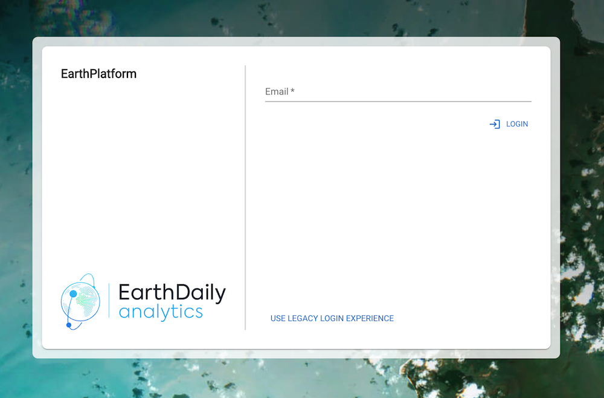
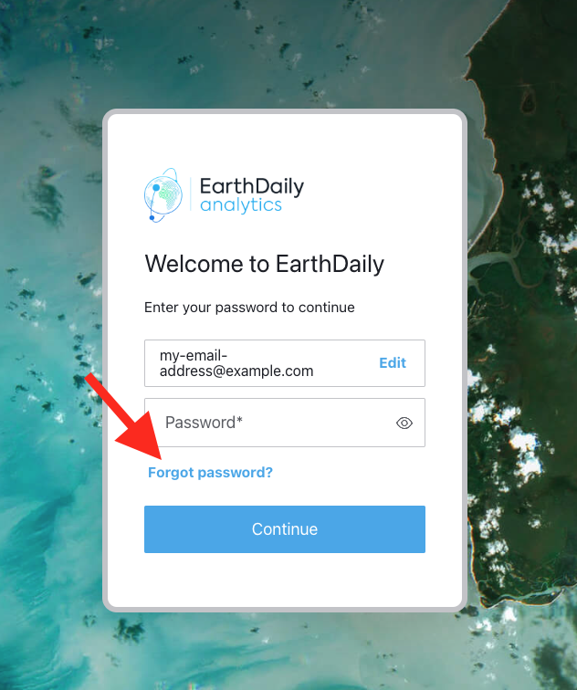
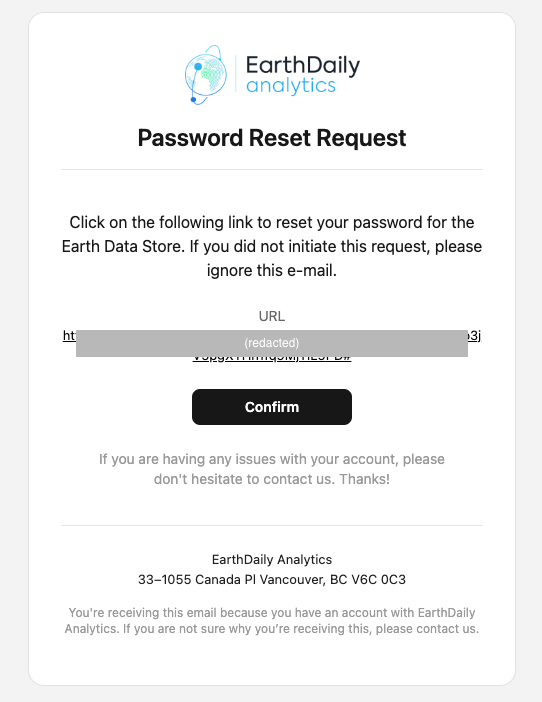

# Table of Contents
* [Login](#login)
    * [Verifying that you're using the new login flow](#verifying-that-youre-using-the-new-login-flow)
    * [Setting Up Your Password](#setting-up-your-password)
* [API Authentication](#api-authentication)
    * [Using the new API token](#using-the-new-api-token)

{: .note }
> On **March 10, 2025** EarthDaily will switch to it's new authentication system for all EarthDaily Console sites. 

{: .important}
> Reminder that you will need to change your password (as mentioned [here](#setting-up-your-password)) if you have an account before March 10th and it's your first time logging in using the new experience. You can reuse your current password if it meets the new security requirements. Note that passwords for the new and old systems are maintained separately, and should to choose to revert to the legacy login system for any reason, its password will remian unchanged.

## Login

Simply enter your email in the text box and click on the *login* button to initialize the new login flow. If you wish to revert to the legacy login experience, click on the *use legacy login experience* link.

<!-- Clicking the *login* button will take you to the new login flow, where you should see the following prompt:

-->

### Verifying that you're using the new login flow

Once in you see the new login prompt, verify that your browser URL starts with `login.earthdaily.com`. For your security, always ensure that you're entering login credentials in a page that's hosted on this domain. EarthDaily will never request your password through any other domain.

### Setting Up Your Password

If this is your first time using our new login system, you need to initiate a password reset process by clicking the **Forgot Password?** link after entering your email address:

You'll receive a password reset link via email that should look similar to the following screenshot. The link would be valid for 5 days, although you can always request a new link by clicking on **Forgot Password?** again. For your safety, always ensure the link in the email goes to an URL under `https://login.earthdaily.com`:

After setting your password, you can return to the console to log in with your new credentials. 

## API Authentication

The new login system introduces an improved API token authentication system. Please provision the new API keys and see if all your connections are working as expected. When provisioning a new API token, you may be asked to log in again if required for security purposes. Users now have the ability to revoke compromised tokens and generate new ones as needed. 

**Upon token generation, you'll be shown your API token exactly once.** Please save it immediately in a password manager or secure vault, as we cannot display it again. If you want to re-provision a new token, you can choose **Delete Current Credentials** button and then you will get an option to provision new API credentials again

### Using the new API token

Your new API token can be used with existing scripts and tools that use the **OAuth Client Credentials Flow** as described in the [Authentication Page](../../GettingStarted/APIAuthentication). Simply use these values in place of your old credential information:

- **EDS_AUTH_URL** (**Access token URL** in the Accounts page): `https://api.earthdaily.com/account_management/v1/authentication/api_tokens/exchange`
- **EDS_CLIENT_ID** (**Client ID** in the Accounts page): `EARTHDAILY_API_TOKEN`
- **EDS_SECRET** (**Client Secret** in the Accounts page): `[Use your new API Token here]`

## Need Help?

Our support team is available to assist you with the transition to the new authentication system. Please don't hesitate to reach out if you have any questions or encounter any issues during the process.
