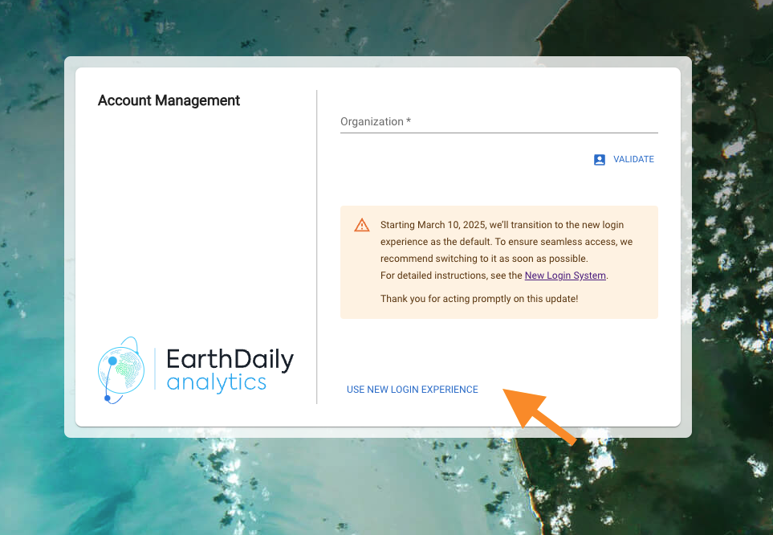
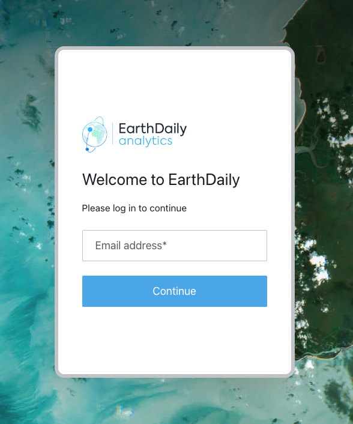

# New Login System

EarthDaily is introducing an enhanced authentication system for all EarthDaily Console sites. This upgrade represents an improvement in our security infrastructure and lays the foundation for advanced security features in the future. Although being default, we're providing a transition period during which both authentication methods will remain accessible.

## How to access the new login experience

To access the new login system, **leave the `Organization` field empty** on the login page (we will keep track of this for you). Instead, immediately look for the **Use New Login Experience ** link in the bottom of the login box.

Clicking the link will take you to the new login flow, where you should see the following prompt:

### Verifying that you're using the new flow

Check [here](../../Console/NewLoginExperience#verifying-that-youre-using-the-new-login-flow)

### Setting Up Your Password

Check [here](../../Console/NewLoginExperience#setting-up-your-password)

## API Authentication

Check [here](../../Console/NewLoginExperience#api-authentication)

## Need Help?

Our support team is available to assist you with the transition to the new authentication system. Please don't hesitate to reach out if you have any questions or encounter any issues during the process.
