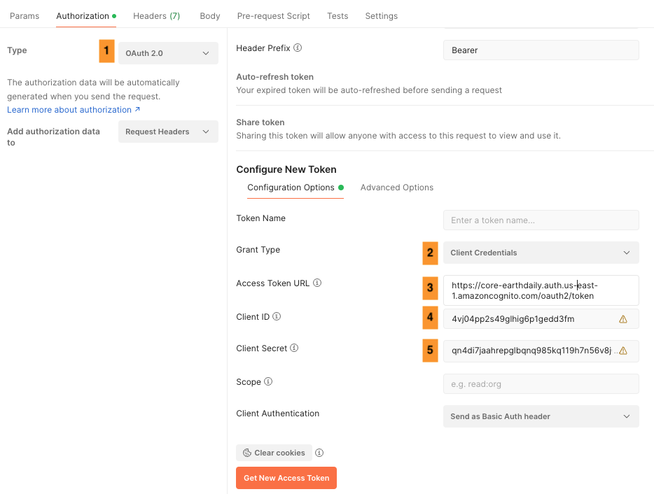

# Table of contents
* [Authentication](#authentication)
    * [Provision New API Credentials](#provision-new-api-credential)
    * [Provision Legacy API Credentials](#provision-legacy-api-credential)
    * [Points to note](#points-to-note)
* [Examples](#examples)
    * [Command Line](#command-line)
    * [Python](#python)
    * [Postman](#postman)

## Authentication

EarthPlatform STAC API is protected by bearer authentication.
A bearer token must be generated using [OAuth Client Credentials Flow](https://www.oauth.com/oauth2-servers/access-tokens/client-credentials/). The required client_id, client_secret and access_token_url values can be found on [Account Management](https://console.earthdaily.com/account) page. These API credentials are specific to your user account on EarthPlatform and should be kept confidential. Please note that we have an option to download the .env file if you want to use it with your scripts. 


{: .note }
The API credentials are different for New and Legacy login flow and you can provision them as explicitly described below. Please note that the new login flow will become the default starting **March 10, 2025**

### Provision New API Credential

Click on the button `PROVISION NEW API CREDENTIALS` on the Accounts page as shown above to get your new account specific credentials. You will see your New API Token as below. Please save this API token for your later reference. 


{: .important }
It is important that you save your credentials once provisioned because it will be shown to you **ONLY ONCE**

When you return to the accounts page after getting new API credentials, you will have two additional options as shown below.
* For any reason, if you want to  re-provision your API credentials, you now have an option to delete the credentials and re-provision it.

* You can also download it as an .env using option `Download .ENV file` to help you directly use in your scripts by replacing the EDS_SECRET value with the token generated above


### Provision Legacy API Credential

If you choose to use the Legacy Login, on the Accounts page under `API Credentials` section, you will find your account specific API credentials. 


Alternatively, you can also download it as an .env file as shown below.


### Points to Note

* The generated access_token will have a 1 hour expiry.
* The access token should be cached locally and included in each STAC API request as a bearer authorization header.
* When the access token has expired, an error 401 (Unauthorized) will be returned from STAC API requests.
* `EDS_AUTH_URL` refers to the **Access token URL** in shown the Accounts page

## Examples

### Command Line
Example curl request to generate token

```
curl --location '<EDS_AUTH_URL HERE>'
--header 'Content-Type: application/x-www-form-urlencoded' \
--data-urlencode 'client_id=<EDS_CLIENT_ID HERE>' \
--data-urlencode 'client_secret=<EDS_SECRET HERE>' \
--data-urlencode 'grant_type=client_credentials'
```

Example curl response

```
{"access_token":"eyJraWQiO.......","expires_in":3600,"token_type":"Bearer"}
```

### Python

```
import json
import os
import requests
from dotenv import load_dotenv

# Loading secrets from environment variables

# By default, Earth Data Store will look for environment variables called
#    EDS_AUTH_URL, EDS_SECRET and EDS_CLIENT_ID
# Ensure environment variables are set before running this script.

# You can set them in your terminal session or add them permanently to your shell configuration
# (e.g., .bash_profile, .bashrc) using the following format:
#
# export EDS_CLIENT_ID="your_client_id"
# export EDS_SECRET="your_client_secret"
# export EDS_AUTH_URL="your_auth_url"
#
# Alternatively, you can manage environment variables using a .env file and the python-dotenv package.
# Our account Information page will allow you to download your EDS.env file

load_dotenv("EDS.env")

CLIENT_ID = os.getenv("EDS_CLIENT_ID")
CLIENT_SECRET = os.getenv("EDS_SECRET")
EDS_AUTH_URL = os.getenv("EDS_AUTH_URL")
API_URL = os.getenv("EDS_API_URL")

# Setup requests session
session = requests.Session()
session.auth = (CLIENT_ID, CLIENT_SECRET)


def get_new_token(session):
    """Obtain a new authentication token using client credentials."""
    token_req_payload = {"grant_type": "client_credentials"}
    try:
        token_response = session.post(EDS_AUTH_URL, data=token_req_payload)
        token_response.raise_for_status()
        tokens = token_response.json()
        return tokens["access_token"]
    except requests.exceptions.RequestException as e:
        print(f"Failed to obtain token: {e}")

print(get_new_token(session))
```

### Postman

Below is the screenshot showing the **Authorization tab** in Postman and follow the steps 

1. Select the Type as <span style = "color: blue">OAuth 2.0</span>
2. Select the Grant Type as <span style = "color: blue">Client Credentials</span>
3. Enter the access token URL from the account information page above 
4. Enter the Client ID from the account information page above 
5. Enter the Client Secret from the account information page above 



